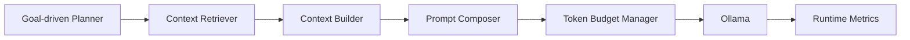
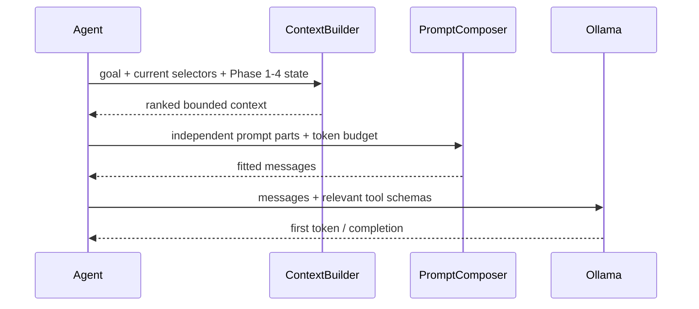

# Phase 4.1 — Context Optimization

Phase 4.1 changes AI orchestration only. Scanner, crawler, payload, evidence and
replay behavior are unchanged.

## Components

| Module | Responsibility |
|---|---|
| `context_optimization/retrievers.py` | Relevant graph, hypothesis evidence and planner-memory retrieval |
| `context_optimization/builder.py` | Bounded action context for goal/endpoint/auth/workflow/hypothesis |
| `context_optimization/composer.py` | Independent System, Planner, Tool, Policy and Reasoning prompt parts |
| `context_optimization/token_budget.py` | Stable token estimate and ordered optional-context pruning |
| `context_optimization/summarizer.py` | Deterministic count/set summaries of older attempts |
| `context_optimization/metrics.py` | Prompt, retrieval, build and LLM latency measurements |

The agent keeps its complete internal transcript and Phase 1–4 state. Before an
LLM request, it builds a new bounded prompt rather than resending that transcript.
The current goal, endpoint, auth context, workflow and hypothesis are stored in
the protected context block and are never truncated.

Retrieval priority is deterministic:

1. current endpoint;
2. current workflow;
3. current auth context;
4. current hypothesis;
5. directly connected and recent observations;
6. successful related strategies;
7. failed related strategies;
8. older history summarized as counts and sorted endpoint sets.

Only evidence connected to the current hypothesis is eligible for evidence
retrieval. Evidence nodes are returned as defensive copies; the evidence store
and Phase 4 replay journal are not modified.

When the estimated context exceeds its budget, optional items are removed in a
fixed order: older history/observations, planner memory, unrelated graph nodes,
then duplicate evidence. Tool schemas are selected from the live plan and
current gate and count toward the estimate.

Ollama requests use separate first-token, completion and overall deadlines. A
server that accepts a connection but produces no token is aborted using the
short first-token timeout instead of consuming the legacy 300-second timeout.

Metrics are available through `WebXAgent.context_runtime_metrics()` and the
interactive `/context-metrics` command. They include prompt characters,
estimated tokens, retrieved nodes/observations/evidence/memory, build times and
LLM latencies. Given identical state and configuration, selection, summaries
and composed prompts are byte-for-byte reproducible.
